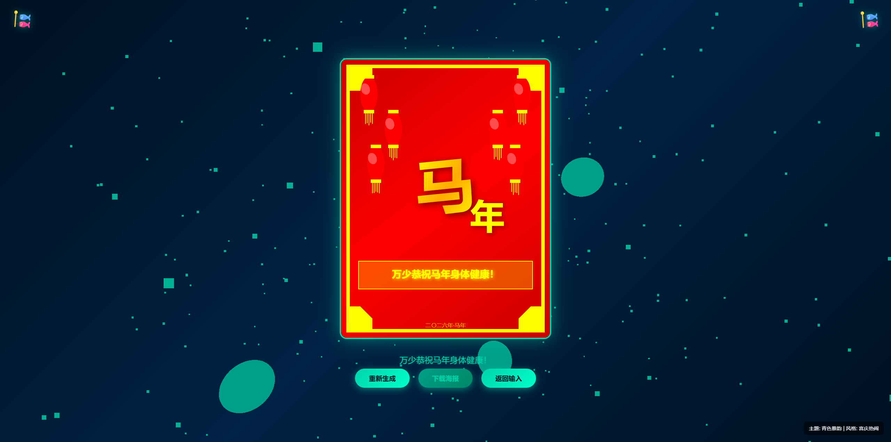
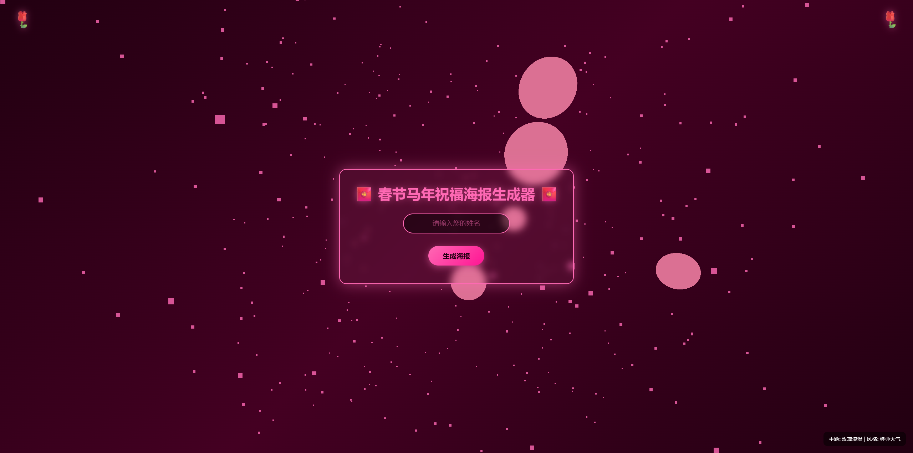
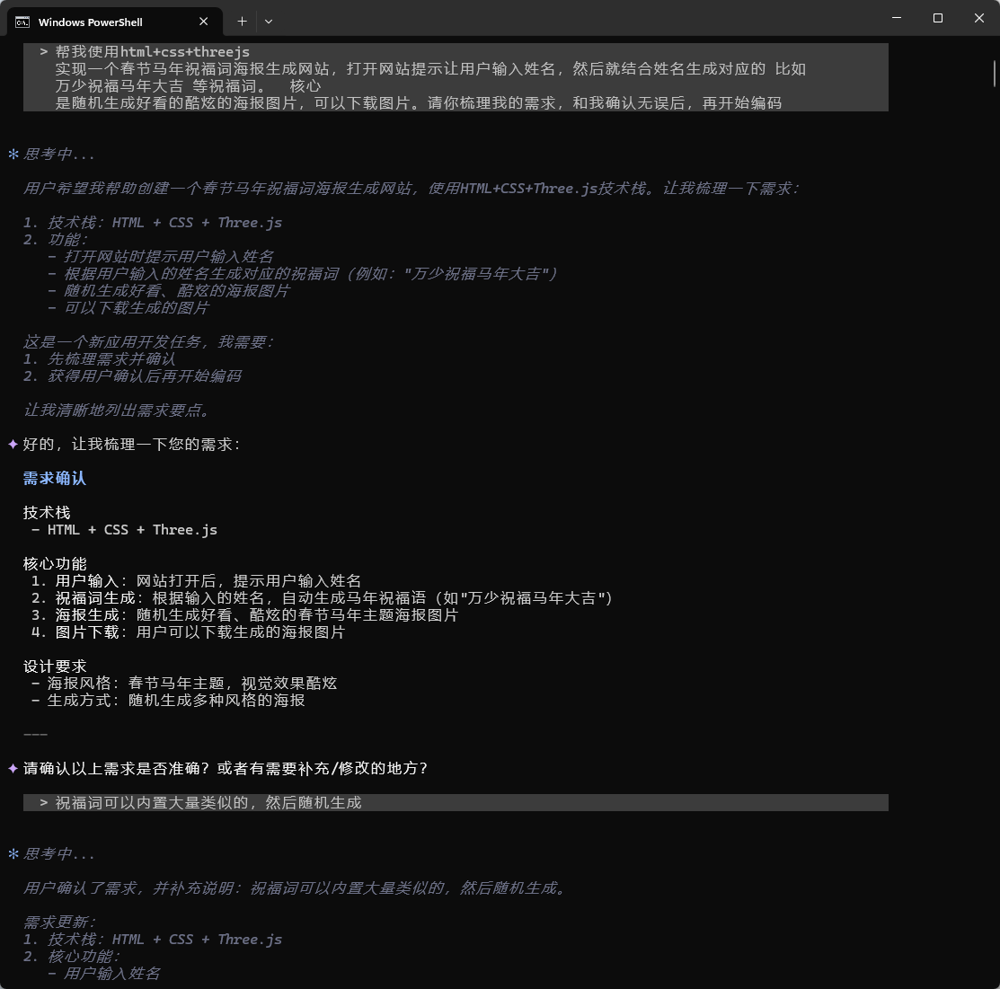

# 春节马年祝福海报生成器 2026

## 项目简介

春节马年祝福海报生成器是一个基于 **HTML + CSS + Three.js** 开发的春节主题互动网站。

用户只需输入姓名，即可生成精美的马年祝福海报，并支持下载分享。

> 这是一个使用iflow+GML4.7 做的静态网站

## 效果

直接上效果：


---



---

刷新了会随机切换主题：



---


---


---

##  技术实现

### 技术栈
- **iflow + GML4.7**
- **HTML5**：页面结构
- **CSS3**：动画效果、渐变、布局
- **Three.js**：3D背景动画
- **Canvas API**：海报绘制

### 核心功能实现

#### 1. Three.js 3D背景
- **粒子系统**：500个金色粒子在3D空间中旋转
- **3D灯笼**：5个红色灯笼悬浮在背景中，带有浮动动画
- **性能优化**：使用透明度和模糊效果，不影响前端性能

#### 2. 海报生成系统
```
海报生成流程：
1. 用户输入姓名 → 2. 随机选择祝福词 → 3. 随机选择渐变背景
→ 4. 绘制装饰元素 → 5. 绘制马年主题 → 6. 添加祝福词 → 7. 渲染完成
```

#### 3. 祝福词库设计
内置30条马年祝福语，采用模板替换机制：
```javascript
const blessings = [
    "{name}祝福马年大吉！",
    "{name}祝您马年马到成功！",
    // ... 更多祝福词
];
```

#### 4. Canvas绘制
- **渐变背景**：8种春节主题渐变色
- **装饰元素**：金色边框、角落花纹、红灯笼
- **文字渲染**：渐变色"马年"字样，带阴影效果
- **祝福词框**：半透明背景 + 金色边框

## 开发流程

1. 在空的目录内启动 **iflow**

   > iflow -y 

2. 输入提示词

   >  帮我使用html+css+threejs
   >       实现一个春节马年祝福词海报生成网站，打开网站提示让用户输入姓名，然后就结合姓名生成对应的 比如
   >       万少祝福马年大吉 等祝福词。  核心
   >       是随机生成好看的酷炫的海报图片，可以下载图片。请你梳理我的需求，和我确认无误后，再开始编码

3. iflow 开始跑



4. 得到网站


